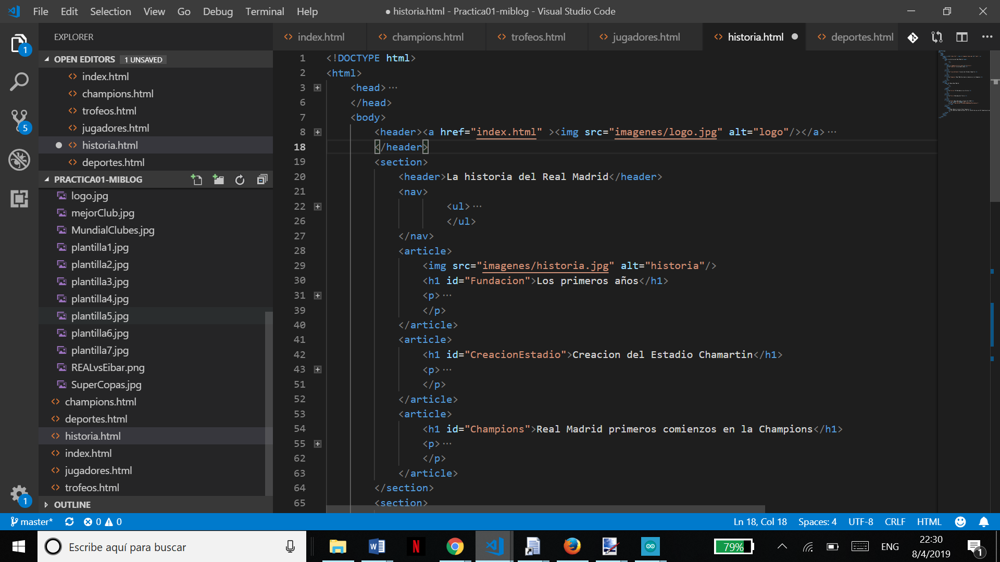
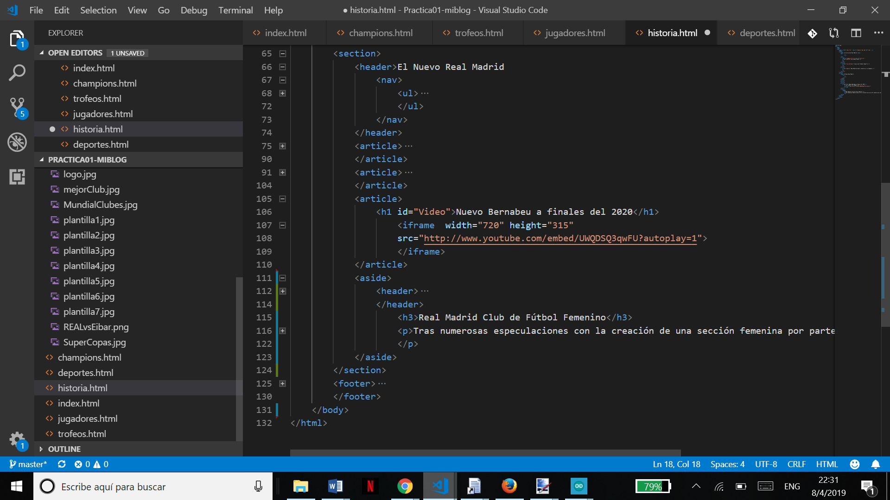
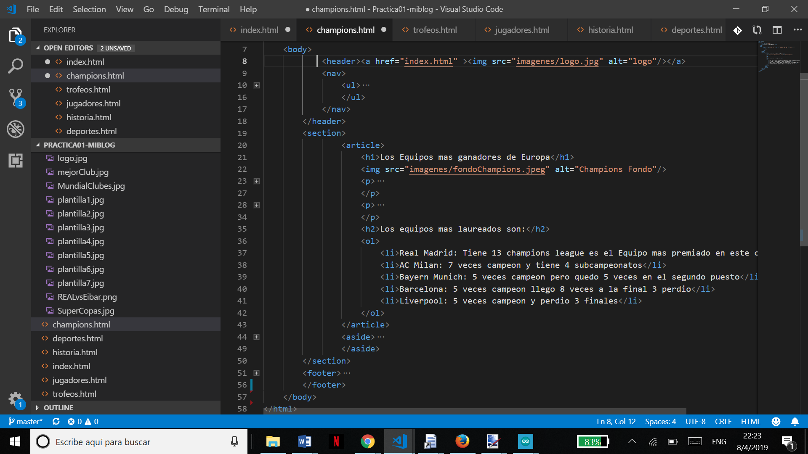
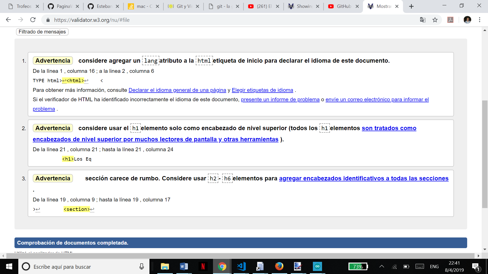
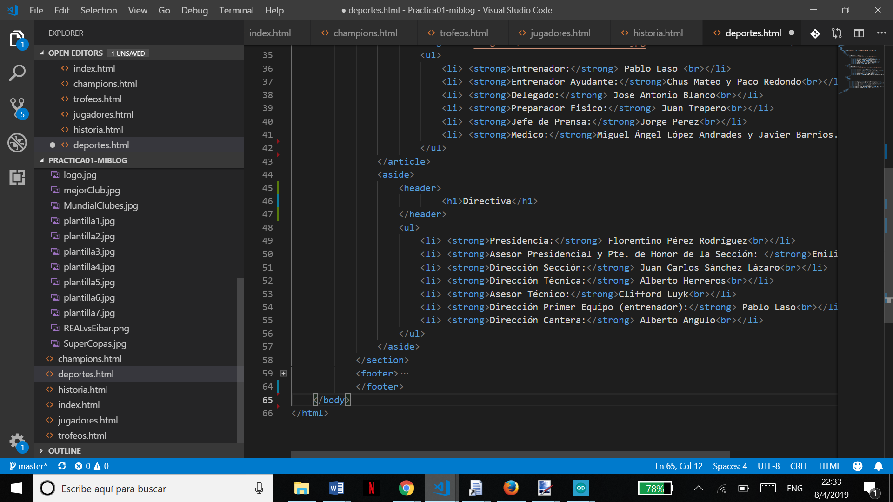
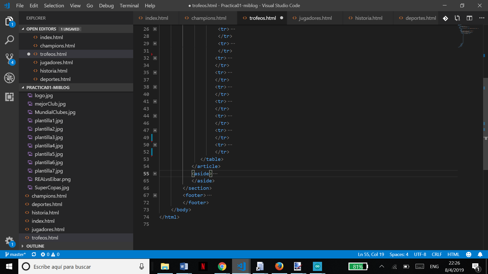
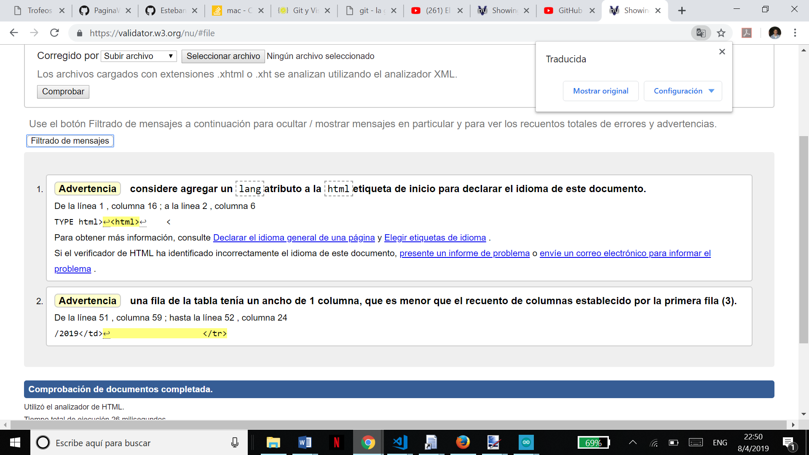
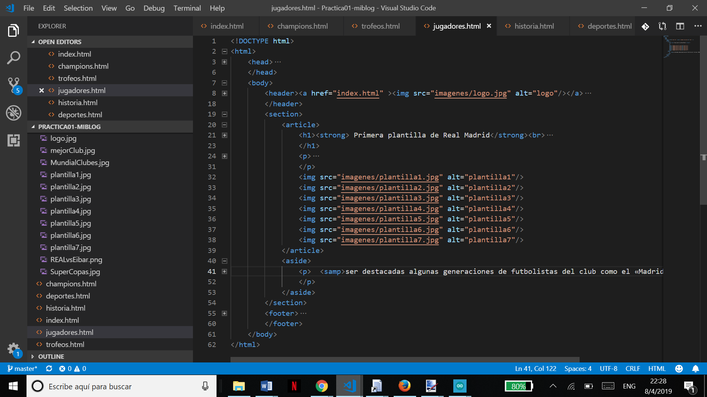
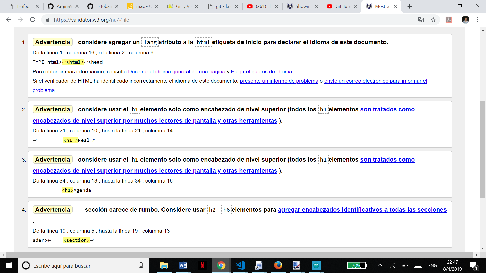
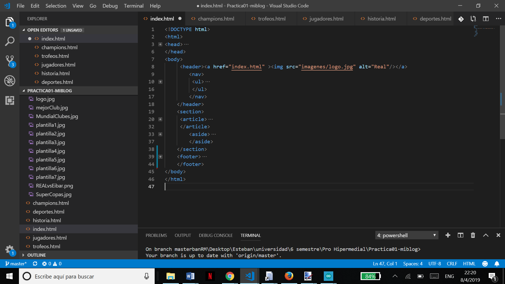

# -Practica01-Mi-Blog  
# creacion de una pagina web 
Se crearon 6 paginas html con la estructura header, nav, section, article, aside y footer  
Para crear las tablas utilizamos las siguientes etiquetas 
-tr se utilizan para crear filas  
-td se utiliza para llenar las columnas 
# En la seccion article se ingresa:
**listas ordenadas  
**listas desordenadas  
**video de youtube  

•	Para agregar un video :
                                      <iframe  width="720" height="315"
                                       src="http://www.youtube.com/embed/UWQDSQ3qwFU?autoplay=1">
                                      </iframe>
       Para agregar se debe colocar el ancho y el alto para la ventana, tambien 
       Se debe colocar el link del video de youtube, colocando autoplay se reproduce 
       Cuando carga el video.
•	También colocamos 5 etiquetas como fueron:
los br para poder saltar en los parrafos como también utilizamos strong para darle como negrita a las letras que 
estan en sus llaves, otra etiqueta fue la var, como también la a para adjuntar hipervínculos, asi como la small
y la samp que nos permite cambiar el tipo de letra como su tamaño. 
> **Nota**
# pagina historia con su validacion en w3c

# pagina champions con su validacion en w3c

# pagina deporte con su validacion en w3c

# pagina trofeo con su validacion en w3c

# pagina jugadores con su validacion en w3c

# pagina historia con su validacion en w3c

# Conclusiones
<ul>
<li>Las paginas web contiene varias etiquetas que se fueron modificando en el pasar de los años con las actualizaciones de html, las etiquetas en el html 5 nos beneficia por que son fáciles de entender y de un rápido aprendizaje ayudando bastante en la elaboración de una paina web.</li>
<li>Las paginas deben tener una buena estructura para un buen funcionamiento ya que con una buen estructura, las paginas tienden a tener mayor numero de visitas.</li>
<li>El trabajo de un desarrollador web no solo es obtener la información necesaria como crear el diseño, ellos se encargan del buen funcionamiento como también de actualizarse año tras año con las nuevas tecnologías que se van mejorando y creando.</li>
<li>El estudio a las personas es una parte fundamental en el ámbito de los desarrolladores web ya que deben tener conocimiento previo para realizar una pagina, las paginas pueden ser direccionadas a ciertos grupos de personas, por ese motivo no se puede hacer todas iguales, unas deben ser mas intuitivas y otras deben tener unos colores específicos.</li>
</ul>
